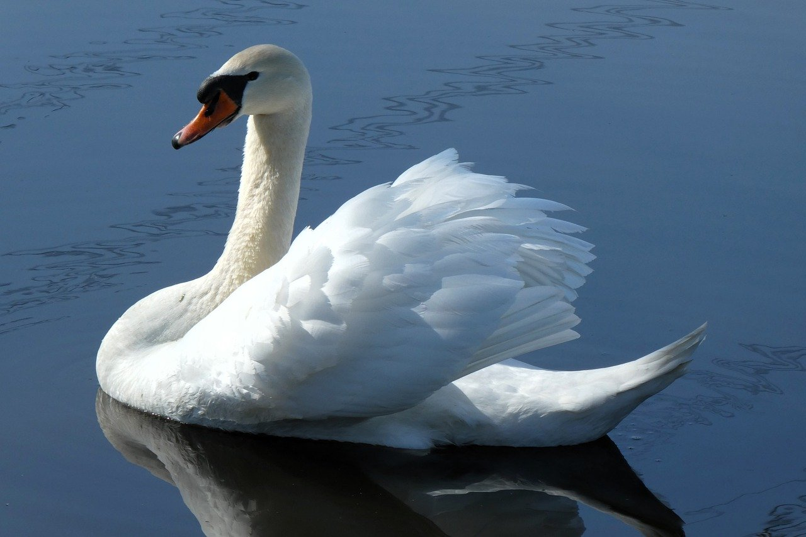

# 🖼️ Image Processing Using NumPy

This project demonstrates how to perform various image processing operations using only NumPy and basic Python libraries — without relying on OpenCV or other high-level image libraries. It's designed to help you understand the mechanics of image transformations through direct pixel-level manipulation.

---

## 📂 Repository Structure

| File/Folder              | Description                                                                 |
|--------------------------|-----------------------------------------------------------------------------|
| `Class_ImgProcessing.py` | Contains the `ImageProcessing` class that defines all image operations.     |
| `Program_ImgProcessing.py` | Interactive terminal-based image processing application using the class.  |
| `ImageProcessing_Demo.ipynb` | Jupyter notebook to demonstrate each function with examples.         |
| `dog.jpg`, `swan.jpg`    | Sample images used for processing and demonstrations.                      |
| `environment.yaml`       | Conda environment file to recreate the development environment.            |
| `requirements.txt`       | List of Python packages used in this project (pip format).                 |

---

## ✨ Features

The `ImageProcessing` class supports the following operations:

- 📷 Display image, compare images side-by-side
- ✂️ Crop
- 🔄 Rotate (clockwise & counter-clockwise)
- ↕️ Flip (horizontal & vertical)
- 🎨 Convert to Grayscale or Negative
- 🔲 Binarisation with thresholding
- 🧹 Blur (Gaussian kernel)
- 🔪 Sharpen
- ⚡ Edge Detection (Sobel filters)
- 🎛️ Custom 2D and 3D convolution
- 🧪 Generate synthetic striped images with blending

---

## 🧰 Technologies Used

- **NumPy** – for all core image processing operations, including slicing, thresholding, and mathematical transformations.
- **PIL (Pillow)** – for loading and converting images to NumPy arrays.
- **Matplotlib** – for displaying images and visual comparisons.
- **SciPy (`scipy.ndimage.convolve`)** – for faster and flexible convolution on 2D and 3D arrays.

---

## 🚀 Getting Started

### 🔧 1. Clone the repository

```bash
git clone https://github.com/your-username/Image-Processing-Using-Numpy.git
cd Image-Processing-Using-Numpy
```

### 🐍 2. Create and activate the Conda environment

```bash
conda env create -f environment.yaml
conda activate image_processing
```

*Alternatively*, if using `pip`:

```bash
pip install -r requirements.txt
```

### ▶️ 3. Run the image processing program

```bash
python Program_ImgProcessing.py
```

### 📓 4. Or explore the notebook interactively

```bash
jupyter notebook ImageProcessing_Demo.ipynb
```

---

## 📸 Preview

 

---

## 📚 License

This project is open-source and free to use. License details can be added here if applicable.

---

## 🙋‍♂️ Author

**Arya Basak**  
Student | Python & ML Enthusiast  
Feel free to contribute, suggest improvements, or raise issues!
